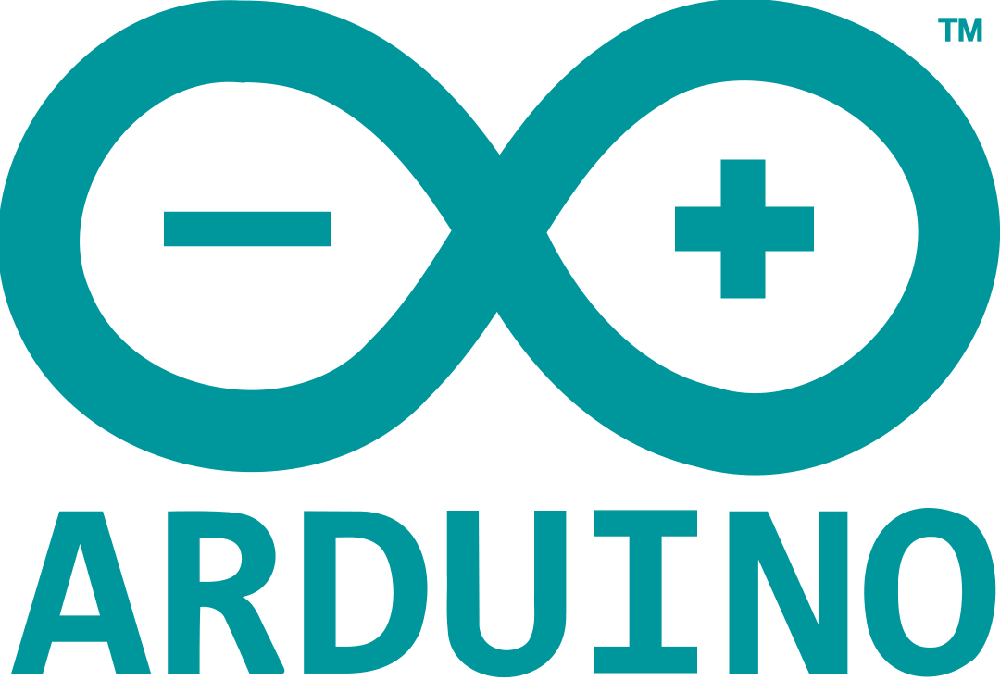

<div align="center">
<h1>Arduino</h1>
</div>



Welcome to my Arduino repository! This collection features my journey from learning basics to advanced projects with [Arduino](http://arduino.cc/). It includes a variety of code snippets, circuits, and detailed experiments as I explore the world of microcontrollers and electronics.

## Table of Contents

1. [Getting Started](#getting-started)
2. [Resources](#resources)
3. [Connect](#connect)
4. [Acknowledgements](#acknowledgements)

## Getting Started

_To explore into this repository, follow these steps:_

- **Clone** the repository:

   ```bash
   git clone https://github.com/eneshtyrgl/Arduino.git
- **Add This repo as Remote**  :

   ```bash
   git remote add origin https://github.com/eneshtyrgl/Arduino.git

- **Create and Switch to Your Branch** :

   ```bash
   git checkout -b YourBranchName

- **push your changes** to this branch :

   ```bash
    git push --set-upstream origin DEV/{your_name}/{in which you working on}

## Resources

* [Official Arduino Documentation](https://docs.arduino.cc/)
* [Arduino IDE Software](https://www.arduino.cc/en/software)
* [Coşkun Taşdemir Personal Website](https://coskuntasdemir.com/)

## Connect

_Connect with me through various portals :_

<table>
  <tr>
    <th></th>
    <th>Social Media</th>
    <th>Username</th>
    <th>Link</th>
  </tr>
  <tr>
    <td></td>
    <td>Email</td>
    <td><code>eneshtytrgl@gmail.com</code></td>
    <td><a href="mailto:eneshtyrgl@gmail.com" target="_blank">Email</a></td>
  </tr>
  <tr>
    <td></td>
    <td>LinkedIn</td>
    <td><code>Enes İhtiyaroğlu</code></td>
    <td><a href="https://www.linkedin.com/in/enes-ihtiyaro%C4%9Flu/" target="_blank">LinkedIn</a></td>
  </tr>
  <tr>
    <td></td>
    <td>Instagram</td>
    <td><code>eneshtyrgl</code></td>
    <td><a href="https://www.instagram.com/eneshtyrgl/" target="_blank">Instagram</a></td>
  </tr>
</table>

## Acknowledgements

I’m so grateful to Coşkun Taşdemir for writing [Arduino](https://coskuntasdemir.com/gomulu-sistemler/arduino-kitabim-satisa-cikti.html) book and teaching more about Embedded Systems.

Feel free to clone this repository and use it as a template for your own "Arduino" journey. Enjoy learning!
🤖☄️